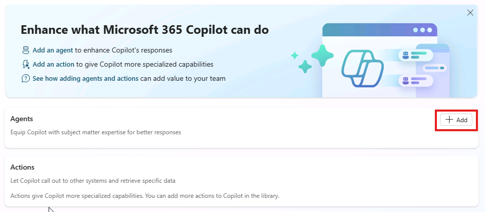
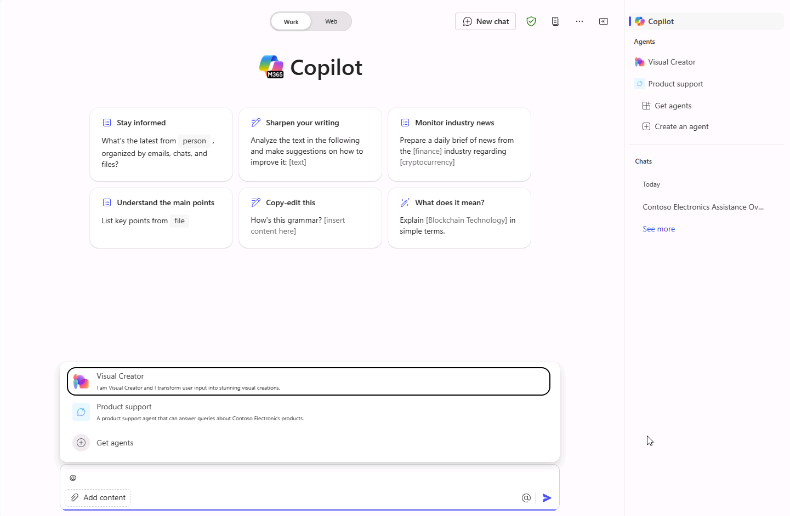

---
lab:
  title: 1.1 Criar um agente declarativo
---

# Criar um agente declarativo

Neste exercício, você criará um agente declarativo usando IA generativa, refinará as instruções, publicará o agente no Microsoft 365 e testará o agente no Microsoft 365 Copilot.

Este exercício deve levar aproximadamente **20** minutos para ser concluído.

## Criar um agente declarativo usando IA generativa

Comece criando um novo agente declarativo no Copilot Studio. Use a IA generativa para redigir as instruções e propriedades do agente.

1. Em um navegador da Web, navegue até o [Microsoft Copilot Studio](https://copilotstudio.microsoft.com/) em `https://copilotstudio.microsoft.com`.
1. Faça login usando uma conta corporativa ou de estudante em que você tenha permissão para criar no Copilot Studio.
1. Se solicitado na página **Bem-vindo ao Microsoft Copilot Studio** , selecione seu país/região e, em seguida, selecione **Introdução**.
1. Se for exibido o pop-up **Bem-vindo ao Copilot Studio!** selecione **Ignorar**.
1. Ao chegar ao Copilot Studio, você provavelmente começará na interface de conversação para criar um novo agente. Este assistente ajuda você a configurar um *agente* personalizado.  Selecione **...** e, em seguida, selecione **Cancelar criação do agente** para sair deste assistente.  Selecione **Sair** para confirmar.

    

1. Navegue até **Agentes** no painel de navegação esquerdo.
1. Selecione **Microsoft 365 Copilot** na página dos agentes.
1. Na página do agente do **Microsoft 365 Copilot** , selecione **Adicionar** na seção Agentes.

    

    Você será encaminhado para a experiência de criação de conversas, onde poderá descrever o agente que deseja criar.

1. É solicitado que você descreva o que gostaria que o agente fizesse.  Na caixa de texto **Digite sua mensagem** na interface de conversação, digite o seguinte:

    ```md
    I'd like to create a product support agent that answers questions related to Contoso Electronics products.
    ```

1. Selecione **Enter** ou **Enviar** para enviar sua mensagem.
1. Se solicitado a sugerir um nome para seu agente, insira `Product support` e envie sua mensagem.
1. Selecione **Ignorar para configurar** na parte superior da interface de conversa para visualizar a página de visão geral do agente e revisar o que a IA generativa configurou até agora.

## Configurar o agente e definir instruções

Em seguida, atualize as propriedades e os metadados do agente manualmente.

1. Revise o **Nome** que o assistente de IA generativa definiu para o agente. Atualize o nome para garantir que seja `Product support`.
1. Atualize a propriedade de **descrição** para `A product support agent that can answer queries about Contoso Electronics products`.
1. Na caixa de texto **Instruções**, insira:
  
    ```md
        You are an agent tasked with answering questions about Contoso Electronics products. Start every response to the user with "Thanks for using a Copilot agent!\n\n" and then answer the questions and help the user.
    ```

1. Selecione o botão **Criar** na parte superior da página.  Após alguns instantes, você será levado para a página de visão geral do agente.

## Testar o agente no Copilot Studio

Em seguida, teste o comportamento do agente no painel de teste no Copilot Studio antes de publicar no Microsoft 365 Copilot.

1. Na página de visão geral do agente em **Suporte ao Produto**, observe na seção **Publicar detalhes** que o agente ainda não foi publicado.

    

1. Se o painel **Testar o agente** não for exibido à direita das informações de visão geral do agente, selecione o botão **Testar** ao lado do botão Publicar para abrir o painel de teste.
1. Na caixa de texto, digite `What can you do?` e envie sua mensagem.
1. Aguarde a resposta. Observe como a resposta começa com o texto "Obrigado por usar um agente do Copilot!" conforme indicado nas instruções definidas para o agente anteriormente.

    

    Observe também que o agente atualmente tem instruções, mas ainda não tem nenhuma fonte de conhecimento ou ação personalizada. Você ainda não configurou o agente para responder a perguntas sobre os produtos da Contoso. Você fará isso no próximo exercício.

    > [!NOTE]
    > Se você precisar editar seu agente, feche o painel de teste e selecione **editar** na seção **Detalhes** da página de visão geral do agente. Antes de testar novamente, selecione o botão de **atualização** dentro do painel de teste para carregar as alterações mais recentes.

## Publicar o agente no Microsoft 365 Copilot

Em seguida, publique seu agente declarativo no Microsoft 365 Copilot. Na página de visão geral do agente de **Suporte ao produto**:

1. Selecione o botão **Publicar**. Será solicitado inserir informações sobre o seu agente que serão exibidas aos usuários no Microsoft 365 Copilot e no Microsoft Teams.

    > [!NOTE]
    > As informações neste formulário são usadas para preencher a entrada do catálogo nos Catálogos do Office e do Teams da sua organização e na lista de Aplicativos Integrados do Microsoft Admin Center. Não é usada pelo modelo de linguagem do Microsoft 365 Copilot para invocar seu agente.

1. Na caixa de texto **Descrição breve**, digite `Answers questions about Contoso Electronics products`.
1. Aceite as sugestões padrão para os campos remanescentes.
1. Selecione **Publicar**.
1. Aguarde o agente ser publicado.  Não feche a janela modal durante a publicação. Isso pode levar alguns minutos.

    > [!NOTE]
    > Quando você seleciona Publicar, um recurso de bot correspondente ao agente é provisionado no ambiente do Microsoft Entra ID do locatário. O recurso permite que os usuários interajam com o agente no Microsoft Teams.

1. Depois que o agente for publicado, a janela **Opções de disponibilidade** será exibida.
1. Em **Compartilhar link**, selecione **Copiar** para copiar o link de compartilhamento do seu agente e selecione **Concluído**.
1. Observe que a seção **Detalhes da publicação** da página de visão geral do seu agente reflete que o agente foi publicado.

    

    Se você precisar copiar o link de compartilhamento novamente, selecione **Opções de disponibilidade** na seção **Detalhes da publicação**.

1. Abra uma nova guia no navegador da Web, cole o link de compartilhamento na barra de URL e pressione **Enter**. Uma janela modal é exibida com uma visão geral do seu agente. Isso exibe as informações voltadas para o usuário que você forneceu sobre o agente durante a publicação, bem como as permissões exigidas pelo agente.

    

1. Selecione **Adicionar** para adicionar o agente ao Microsoft 365 Copilot.
1. Aguarde até que o agente seja adicionado. Seu agente é iniciado no Microsoft 365 Copilot.

## Testar o agente no Microsoft 365 Copilot

Em seguida, vamos executar o agente declarativo no Microsoft 365 Copilot e validar sua funcionalidade nas experiências **imersiva** e **no contexto**.

Seguindo as etapas anteriores, você está atualmente na experiência do agente **imersivo** . Observe no painel **Agentes** na lateral da interface de chat que o **Suporte ao Produto** está selecionado como o agente com o qual você está conversando diretamente.


1. Na caixa de texto, digite `What can you do?` e envie sua mensagem.
1. Envie a mensagem e aguarde a resposta. Observe como a resposta começa com o texto "Obrigado por sua pergunta!" seguindo as orientações que você forneceu nas instruções do agente.

Continuando no navegador, vamos testar a experiência **no contexto**.

1. Acima do painel **Agentes** na barra lateral, selecione **Chat** ou **M365 Copilot** para sair do chat imersivo com o agente de **Suporte ao Produto** e conversar com o Microsoft 365 Copilot.

    

1. Na caixa de mensagem, digite o símbolo <kbd>@</kbd>. O submenu aparecerá com uma lista de agentes disponíveis.

    

1. No submenu, selecione **Suporte ao produto**. Observe a mensagem de status acima da caixa de mensagem: **Chat com o suporte ao produto**, o que significa que você está usando a experiência no contexto do agente.

    

1. Na caixa de texto, digite `What can you do?` e envie sua mensagem.

1. Aguarde a resposta. Observe como a resposta começa com o texto "Obrigado por sua pergunta!" seguindo as orientações que você forneceu nas instruções do agente.

1. Para sair da experiência no contexto, clique no (X) na mensagem de status. Observe que a mensagem de status foi removida e uma mensagem é exibida na janela do chat indicando que você não está mais conversando com o agente.

    

Agora você testou seu agente nas experiências imersivas e no contexto no Microsoft 365 Copilot.
