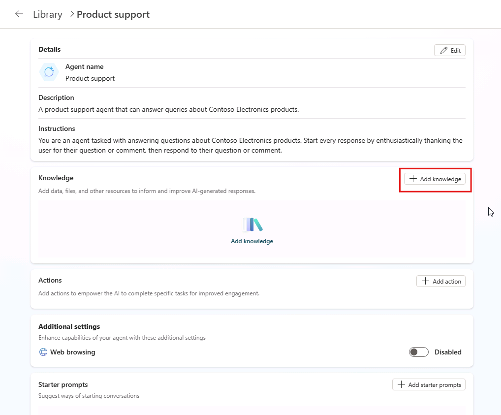

---
lab:
  title: '1.2: Adicionar conhecimento personalizado'
---

# Adicionar conhecimento personalizado

Neste exercício, você atualizará o agente declarativo criado no exercício anterior com instruções personalizadas e dados de fundamento. Este exercício pressupõe que você tenha um site do SharePoint com uma biblioteca de documentos chamada "Produtos" que contém arquivos de produto de exemplo.

Este exercício deve levar aproximadamente **20** minutos para ser concluído.

## Antes de começar

Antes de iniciar este exercício, você precisará carregar os documentos relacionados ao produto no Microsoft 365 que o agente declarativo usará como dados de base. Conclua as etapas abaixo para se preparar para o exercício.

> [!NOTE]
> Quando você faz upload de documentos em um novo site do SharePoint Online, há um atraso antes que os documentos sejam indexados e disponibilizados para uso pelo Copilot. Se você deseja testar seu agente imediatamente, faça o upload dos documentos para um site **existente** . Os documentos serão indexados e estarão disponíveis para uso pelo agente sem demora. Se você optar por usar um novo site do SharePoint Online, os documentos poderão levar mais tempo para serem indexados e disponibilizados para uso pelo Copilot.
>
> **As instruções abaixo orientam você no upload dos documentos para um novo site**. Se você quiser usar um site já existente, comece com a seção **Fazer upload de dados de amostra** e use sua biblioteca existente no lugar da biblioteca de **Produtos**.

### Baixe os dados de exemplo

1. Em um navegador da Web, navegue até o [repositório do GitHub](https://github.com/MicrosoftLearning/MS-4022-Extend-Microsoft-365-Copilot-in-Copilot-Studio/blob/master/Allfiles/Products.zip) do curso.
1. Selecione o botão de **download de arquivo raw** para baixar **Products.zip**.

    :::image type="content" source="../media/download-github.png" alt-text="Captura de tela do Microsoft Edge destacando o botão de download de arquivo raw no GitHub.":::

1. **Abra** a pasta baixada e **extraia todo** o conteúdo para uma nova pasta em sua máquina chamada `Products` que você pode acessar mais tarde.

### Criar um site do SharePoint

1. Em um navegador da Web, navegue para [https://www.microsoft365.com](https://www.microsoft365.com) e **entre** com a conta da Microsoft 365 que você está usando para este laboratório.
1. No menu à esquerda, selecione **Aplicativos** (ícone de grade) e, em seguida, selecione **SharePoint** no catálogo de aplicativos.
1. No menu à esquerda, selecione **Criar** (ícone de adição) e, em seguida, selecione **Site**.
1. Selecione **Site de equipe** como o tipo de site.
1. Na página **Selecionar um modelo**, selecione **Equipe padrão**.
1. Na página **Visualização**, selecione **Usar modelo**.
1. Na página **Dê um nome ao seu site**, digite  `Product support` e selecione **Avançar**.
1. Na próxima página de configuração, altere as **Configurações de privacidade** para **Pública**.
1. Selecione **Criar site**. A criação do site pode levar alguns instantes até que o botão **Concluir** seja ativado.
1. Selecione **Concluir**.

### Criar uma biblioteca de documentos

1. No site do SharePoint de **suporte ao produto**, selecione o botão **Novo** na parte superior da página e selecione **Biblioteca de documentos**.
1. Na página **Criar uma nova biblioteca de documentos**, selecione **Biblioteca em branco** .
1. No campo **Nome**, insira `Products` e clique em **Criar**.

### Carregar dados de exemplo

1. Na biblioteca **Produtos**, selecione o botão **Carregar** e, em seguida, selecione **Arquivos**.
1. Navegue até a pasta em seu computador onde você salvou os arquivos de amostra em uma etapa anterior.
1. **Selecione todos** os arquivos na pasta Produtos local e selecione **Abrir** para fazer seu upload no SharePoint.
1. Aguarde a conclusão do upload. Os arquivos agora aparecerão na biblioteca de **Produtos** no SharePoint.

### Copiar a URL do SharePoint

Em seguida, copie o URL direto para o site para uso ao configurar o conhecimento do agente.

1. Na página da biblioteca de **Produtos** no SharePoint, selecione o ícone **Configurações**na parte superior direita e escoha **Configurações da biblioteca** em seguida, **Mais configurações da biblioteca**.

    :::image type="content" source="../media/sharepoint-library-settings.png" alt-text="Captura de tela do Microsoft Edge mostrando a opção de configurações da biblioteca no menu de configurações.":::

1. Localize a propriedade do **Endereço Web**. A **URL do site do SharePoint** é a parte do endereço Web que está no formato `https://DOMAIN.sharepoint.com/sites/SITE_NAME/LIBRARY_NAME`. Sua URL deve ser `https://DOMAIN.sharepoint.com/sites/ProductSupport/Products`.
1. **Copie** a URL do site do SharePoint e salve-a para uso nas próximas etapas do laboratório.

## Configure seu agente com conhecimento personalizado

Adicione a URL do SharePoint ao seu agente como uma fonte de conhecimento de base.

### Adicionar URL do SharePoint

1. Em um navegador da Web, navegue até o [Microsoft Copilot Studio](https://copilotstudio.microsoft.com/) em `https://copilotstudio.microsoft.com`.
1. Selecione **Agentes**.
1. Selecione **Copilot para Microsoft 365**.
1. Selecione o agente de **Suporte ao Produto**.
1. Na seção **Conhecimento** da página de visão geral do agente, selecione **Adicionar Conhecimento**.

    

1. Na página **Adicionar conhecimento** do assistente que é aberto, selecione **SharePoint**.
1. Na caixa de texto, cole a URL da biblioteca do SharePoint de **Produtos** e selecione **Adicionar**. Isso deve estar no formato: `https://DOMAIN.sharepoint.com/sites/ProductSupport/Products`.

1. Selecione **Adicionar** na janela **Adicionar SharePoint** e aguarde até que a fonte de conhecimento seja adicionada ao agente. Isso pode levar alguns minutos.
1. Observe que a biblioteca **Produtos** está listada na seção **Conhecimento** das informações de visão geral do agente.

> **Observação**: os agentes do Copilot Studio acessam documentos em nome do usuário. Seu agente só poderá obter respostas e conteúdo de documentos aos quais seus usuários finais têm acesso.

### Atualizar instruções personalizadas

Em seguida, atualize as instruções do agente para descrever como o agente deve usar a fonte de conhecimento.

1. Na página de visão geral do agente no Copilot Studio, selecione **Editar** na seção **Detalhes** .
1. Atualize o conteúdo da caixa de texto **Instruções** para o seguinte: `You are an agent tasked with answering questions about Contoso Electronics products. Start every response by enthusiastically thanking the user for their question or comment, then respond to their question or comment. You will use documents from the Products folder in SharePoint as your source of information. If you can't find the necessary information, you should suggest that the agent should reach out to the team responsible for further assistance. Your responses should be concise and always include a cited source.`
1. Selecione  **Salvar** na seção **Detalhes**.

## Testar seu agente no Copilot Studio

Por fim, teste a capacidade do agente de usar a fonte de conhecimento personalizada.

1. No painel **Testar seu agente** na página de visão geral do agente no Copilot Studio, selecione o botão **atualizar** para atualizar o painel de teste e carregar as alterações mais recentes do agente.
1. Na caixa de texto da conversa de teste, insira `Tell me about Eagle Air` e envie a mensagem.
1. Aguarde a resposta. Observe que a resposta contém informações sobre o drone Eagle Air. A resposta contém citações e referências ao documento da Eagle Air armazenado no SharePoint.

Vamos tentar mais alguns prompts:

1. Na caixa de mensagem, insira `Recommend a product suitable for a farmer` e envie a mensagem.
1. Aguarde a resposta. Observe que a resposta contém informações sobre o Eagle Air e contexto extra sobre o motivo pelo qual o Eagle Air é recomendado. A resposta contém citações e referências ao documento da Eagle Air armazenado no OneDrive.
1. Na caixa de mensagem, insira `Explain why the Eagle Air is more suitable than Contoso Quad` e envie a mensagem.
1. Aguarde a resposta. Observe que a resposta explica com mais detalhes por que o Eagle Air é mais adequado do que o Contoso Quad para uso por agricultores.

Por fim, vamos testar a resposta de fallback fazendo uma pergunta que o agente não pode responder:

1. Na caixa de mensagem, insira `When was Mark8 released?` e envie a mensagem.
1. Aguarde a resposta. Observe que a resposta sugere que o agente deve entrar em contato com a equipe responsável para obter mais assistência, conforme definido nas instruções.
