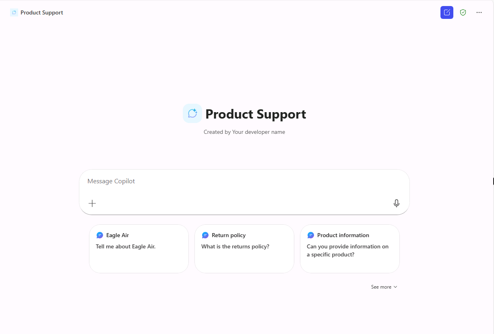

---
lab:
  title: '1.3: Adicionar prompts iniciais'
---

# Adicionar prompts sugeridos

Neste exercício, você atualizará o agente declarativo criado no exercício anterior com seis prompts sugeridos.

Esse exercício deve levar aproximadamente **10** minutos para ser executado.

## Defina prompts sugeridos

No Copilot Studio:

1. Navegue até a página **Visão Geral** do agente de **Suporte ao Produto**.
1. Na seção **Prompts sugeridos**, selecione **Adicionar prompts sugeridos**.
1. Adicione os prompts a seguir:

      | Título                  | Prompt                                              |
      |------------------------|--------------------------------------------------|
      | Informações sobre produtos    | Diga-me sobre a Eagle Air                          |
      | Política de devoluções         | Qual é a política de devoluções?                      |
      | Informações sobre produtos    | Você pode fornecer informações sobre um produto específico? |
      | Solução de problemas de produto| Estou tendo problemas com um produto. Pode me ajudar a solucionar o problema? |
      | Informações sobre reparos     | Pode fornecer informações sobre como consertar um produto? |
      | Contate o suporte        | Como posso entrar em contato com o suporte para receber ajuda?              |

1. **Salve** suas alterações.

## Republicar seu agente

Vamos publicar o agente atualizado no Microsoft 365 Copilot.

1. Selecione **Publicar** no canto superior direito da página de visão geral do agente no Copilot Studio.
1. Na janela modal que é aberta, selecione **Publicar**.
1. Na janela **Opções de disponibilidade** que é aberta, selecione **Copiar** no título **Compartilhar link**.
1. Em uma guia diferente do navegador da web, **cole** o link de compartilhamento do agente e pressione **Enter**. Uma janela é exibida descrevendo o agente de **suporte ao produto**.
1. Selecione **Atualizar agora** sob o nome do agente para publicar as alterações no agente de suporte ao produto. Aguarde alguns instantes enquanto o agente é atualizado.
1. Quando a atualização estiver concluída, feche a janela modal. Se você não for levado ao Microsoft 365 Copilot em seu navegador, selecione **Copilot** no menu à esquerda ou no menu **Aplicativos** no portal do Microsoft 365.

## Teste o seu agente no Microsoft 365 Copilot.

1. No **Microsoft 365 Copilot**, clique no ícone no canto superior direito para **expandir o painel lateral do Copilot**.
1. Encontre **Suporte ao produto** na lista de agentes e selecione-o para entrar na experiência imersiva para conversar diretamente com o agente. Observe que os prompts sugeridos que você definiu no Copilot Studio são exibidos na interface do usuário.

    
1. **Selecione** um prompt sugerido e revise a resposta.
