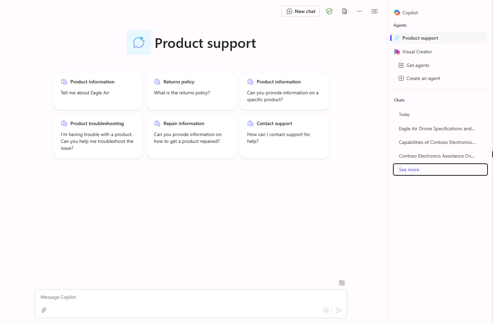

---
lab:
  title: '1.3: Adicionar prompts sugeridos'
---

# Adicionar prompts sugeridos

Neste exercício, você atualizará o agente declarativo criado no exercício anterior com seis prompts sugeridos adequados.

Esse exercício deve levar aproximadamente **10** minutos para ser executado.

## Defina prompts sugeridos

No Copilot Studio:

1. Navegue até a página **Visão Geral** do agente de **Suporte ao Produto**.
1. Observe que o assistente de criação do agente de conversação gerou prompts sugeridos para o agente durante a criação. Vamos substitui-los por prompts mais apropriados, baseados nas capacidades do agente.
1. Na seção **Prompts sugeridos**, selecione o ícone **Editar**.
1. Substitua os prompts existentes pelo seguinte:

      `Eagle Air` : `Tell me about Eagle Air`

      `Return policy` : `What is the returns policy`              

      `Product information` : `Can you provide information on a specific product?` 

      `Product troubleshooting` : `I'm having trouble with a product. Can you help me troubleshoot the issue?` 

      `Repair information ` : `Can you provide information on how to get a product repaired?`
      
      `Contact support` : `How can I contact support for help?`

1. Selecione **Salvar** para salvar as alterações. 

## Republicar seu agente

Vamos publicar o agente atualizado no Microsoft 365 Copilot.

1. Depois que as alterações do seu agente forem salvas com sucesso, selecione **Publicar** no canto superior direito da página de visão geral do agente no Copilot Studio.
1. Na janela modal que é aberta, selecione **Publicar**.
1. Na janela **Opções de disponibilidade** que é aberta, selecione **Copiar** no título **Compartilhar link**.
    
1. Em uma guia diferente do navegador da web, **cole** o link de compartilhamento do agente e pressione **Enter**. Uma janela é exibida descrevendo o agente de **suporte ao produto**.
1. Selecione **Atualizar agora** sob o nome do agente para publicar as alterações no agente de suporte ao produto. Aguarde alguns instantes enquanto o agente é atualizado.
1. Quando a atualização estiver concluída, feche a janela modal. Se você não for levado ao Microsoft 365 Copilot em seu navegador, selecione **Copilot** no menu à esquerda ou no menu **Aplicativos** no portal do Microsoft 365.

## Teste o seu agente no Microsoft 365 Copilot.

1. No painel lateral do **Microsoft 365 Copilot**, localize **Suporte ao Produto** na lista de agentes e selecione-o para entrar na experiência imersiva para conversar diretamente com o agente. Observe que os prompts sugeridos que você definiu no Copilot Studio são exibidos na interface do usuário.

    
1. **Selecione** um prompt sugerido, **envie** a mensagem e examine a resposta.
