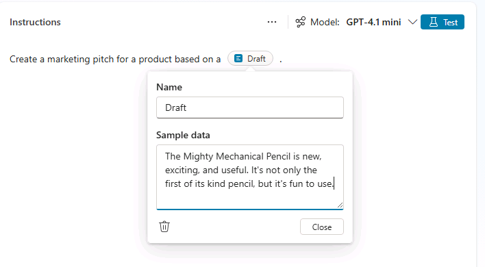
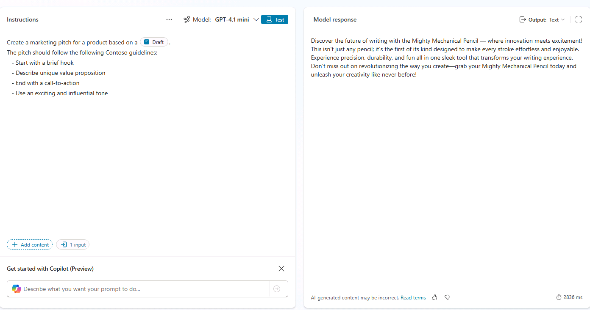
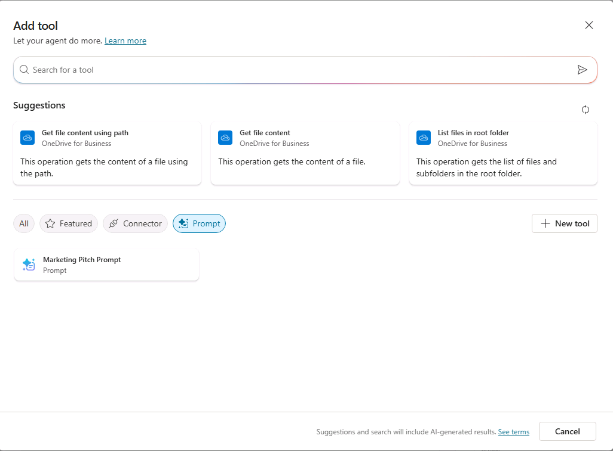
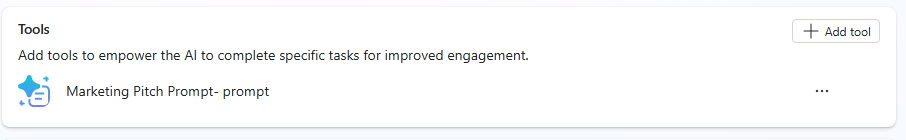

---
lab:
  title: 2.1 Criar uma ação de prompt
---

# Criar uma ação de prompt

Neste exercício, você criará uma ação de prompt, testará o prompt no Copilot Studio e testará o prompt em um agente do Copilot. Você criará uma ação de prompt que ajuda os usuários a transformar suas ideias brutas em argumentos de marketing organizados que seguem um formato e diretrizes específicos.

Este exercício deve levar aproximadamente **15** minutos para ser concluído.

## Criar um prompt personalizado no Copilot Studio

1. Abra o Copilot Studio em seu navegador da Web navegando até o [Copilot Studio](https://copilotstudio.microsoft.com) em `https://copilotstudio.microsoft.com`.
1. Selecione **Ferramentas** na navegação à esquerda.
1. Selecione **Nova ferramenta**.
1. Na janela pop-up Nova ferramenta, selecione **Solicitar**. Você vai acessar a interface do usuário do construtor de prompts. O Copilot está disponível nesta janela, mas definiremos nosso prompt manualmente para este exercício.
1. Na caixa de texto na parte superior da janela, selecione o nome gerado automaticamente e substitua-o pelo nome **Prompt de Pitch de Marketing**.
1. Na caixa de texto **Instruções**, insira `Create a marketing pitch for a product based on a `.
1. Coloque o cursor no final da frase que você inseriu e selecione **Adicionar conteúdo**
1. Selecione **Texto**.
1. No campo **Nome**, insira `Draft`.
1.  No campo **Dados de amostra**, insira `The Mighty Mechanical Pencil is new, exciting, and useful. It's not only the first of its kind pencil, but it's fun to use.` e selecione **Fechar**.

    

## Testar e refinar seu prompt

1. Selecione **Testar** acima da caixa de instruções para testar o prompt com os dados de exemplo fornecidos.
1. Veja a saída da execução do teste na seção **Resposta do modelo**.

Vamos refinar o prompt para criar uma saída mais estruturada e consistente.

1. Na caixa de texto **Instruções**, adicione o seguinte às instruções existentes para modificar o prompt:

    ```The pitch should follow the following Contoso guidelines:
       - Start with a brief hook
       - Describe unique value proposition
       - End with a call-to-action
       - Use an exciting and influential tone
    ```

1. Selecione **Testar** novamente para testar novamente o prompt.
1. Observe como a resposta difere.
    
1. Selecione **Salvar** para salvar o prompt.

## (Opcional) Adicionar uma ação de prompt a um agente

Se você concluiu o laboratório anterior e criou um agente declarativo, pode adicionar essa ação ao seu agente e atualizar as instruções do agente para fazer referência à ação.

### Adicionar a ferramenta de prompt

1. Na barra lateral no Copilot Studio, selecione **Agentes**.
1. Selecione **Microsoft 365 Copilot**.
1. Em **Agentes**, selecione o agente de **Suporte ao Produto** ao qual você deseja adicionar a ação.
1. Na seção **Ferramentas** da página, selecione **Adicionar ferramenta**.
1. Selecione o filtro **Prompt**.
1. Selecione a ferramenta **Prompt de Pitch de Marketing**.
    
1. Selecione **Adicionar e configurar** e espere a ferramenta ser adicionada. A ferramenta agora está listada nas **Ferramentas** do agente de Suporte ao Produto.
    

### Atualizar as instruções do agente e os prompts de início

Atualize as instruções do agente para fornecer diretrizes para usar o prompt.

1. Na caixa de texto **Instruções**, adicione o seguinte ao texto de instruções existente e, em seguida, **Salve** suas alterações: `Use the Marketing Pitch Prompt tool to craft pitches for products that follow Contoso guidelines based on users' draft ideas.`
1. Na seção **Prompts sugeridos**, substitua o prompt sugerido do Eagle Air pelo seguinte prompt e **salve** suas alterações: `Marketing Pitch` : `Create a marketing pitch following Contoso guidelines based on the following draft:`.

Você concluiu o exercício e criou uma ferramenta de prompt para seu agente.
