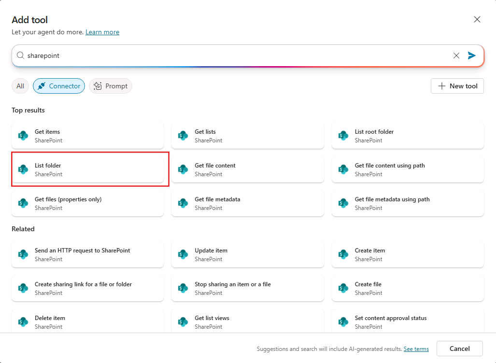
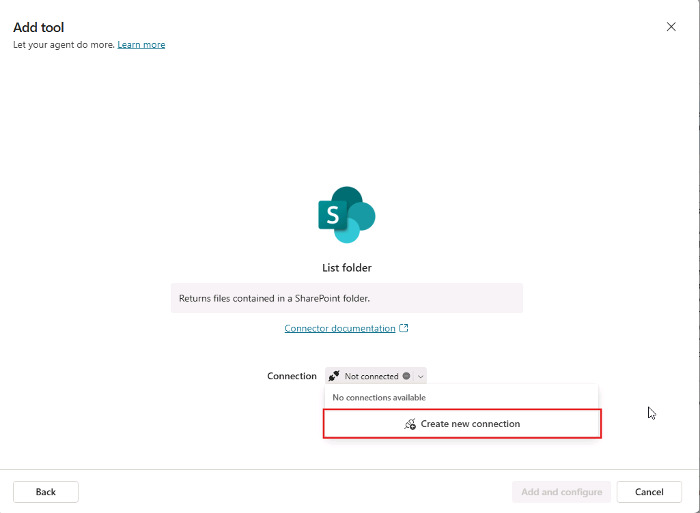
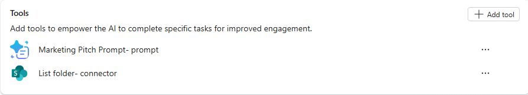
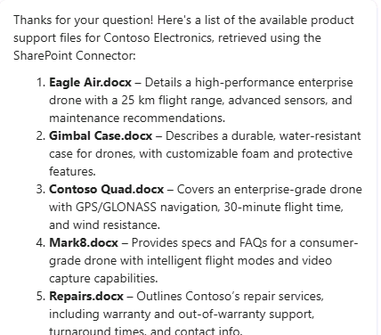

---
lab:
  title: '3.1: Criar uma ferramenta Conector'
---

# Criar uma ferramenta Conector

Neste exercício, você configurará uma ferramenta Conector para um agente declarativo no Copilot Studio. Você usará o conector "SharePoint – Pasta de lista" para recuperar uma lista de arquivos de uma pasta Produtos que contém arquivos de suporte ao produto.

Este exercício deve levar aproximadamente **15** minutos para ser concluído.

## Antes de começar

Este exercício se concentra na adição de ferramentas Conector a um agente existente. Este exercício pressupõe o seguinte:

1. você já criou um agente declarativo de **suporte ao produto** no Copilot Studio. Se você precisar de instruções para criar um agente declarativo, consulte: [Criar um agente declarativo](../01-Build-your-first-declarative-agent/01-create-declarative-agent.md).
1. Você tem um site do SharePoint intitulado **Suporte ao Produto** que contém uma biblioteca de documentos chamada **Produtos** contendo arquivos com dados de exemplo relacionados ao produto. Para obter instruções, consulte a seção **Antes de começar** no exercício: [Adicionar conhecimento personalizado](../01-Build-your-first-declarative-agent/02-add-custom-knowledge.md).

## Criar uma ferramenta Conector do SharePoint a partir de um conector predefinido

Crie uma ferramenta Conector usando o conector predefinido da pasta de lista do SharePoint e adicione ao agente.

1. No navegador da Web, navegue até o [Copilot Studio](https://www.copilotstudio.microsoft.com) em `https://www.copilotstudio.microsoft.com`.
1. Na barra lateral, selecione **Agentes**.
1. Selecione **Microsoft 365 Copilot**.
1. Em **Agentes**, selecione o agente de **Suporte ao Produto**.
1. Em **Ferramentas**, selecione **Adicionar ferramenta**.
1. Na janela **Adicionar ferramenta**, selecione o botão **Conector** para filtrar as ferramentas do Conector e, em seguida, insira `SharePoint` na barra de **Pesquisa** e selecione **Pesquisar**. Aguarde até que os conectores relevantes sejam exibidos na janela.
1. Navegue e selecione o conector **Pasta de lista** do SharePoint.
    
1. A janela modal exibe uma conexão para o conector do SharePoint. Uma marca de seleção verde será exibida ao lado do conector quando sua conexão estiver ativa. Você pode selecionar o **...** para exibir detalhes sobre a conexão. Se o status for `Not connected`, selecione a lista suspensa ao lado de **Não conectado** e selecione **Criar nova conexão**.
    
1. Na página **Conectar ao SharePoint**, selecione **Conectar diretamente (serviços de nuvem)** e, em seguida, selecione **Criar**.
1. Será solicitado que você entre. Conecte-se com a conta do M365 sendo usada para o exercício.
1. Na página **Adicionar ferramenta**, depois que uma conexão for estabelecida, selecione **Adicionar e configurar** para adicionar a ferramenta ao seu agente.
1. Confirme se a ferramenta **Listar pasta - conector** está listada na seção **Ferramentas** do agente.
    

## Configurar a ferramenta de conector para seu agente

Configure as propriedades da ferramenta Conector para o agente.

1. Na página do agente de **Suporte ao produto**, em **Ferramentas**, selecione a ferramenta **Listar pasta - conector** adicionada na seção anterior.
1. Na caixa de texto **Nome**, insira `List product support files`.
1. Insira `List product support files available in the Products folder` na caixa de texto descrição **Descrição**.
1. Selecione a alternância ao lado de **Detalhes adicionais** para revelar propriedades adicionais.
1. Na caixa de texto **Descrição** na seção **Detalhes adicionais**, digite “Faça logon para acessar o site do SharePoint de Suporte ao Produto”.
1. Na seção **Entradas**, localize a entrada **Endereço do site**. Na caixa de texto **Valor**, insira o URL do site do SharePoint de **Suporte ao Produto** no formato `https://DOMAIN.sharepoint.com/sites/ProductSupport` e selecione **Concluído**.
1. Em seguida, localize a entrada do **Identificador de Arquivo**. Defina o campo **Preencher usando** como **Valor personalizado** na lista suspensa.
1. Na caixa de texto **Valor** do **Identificador de Arquivo**, insira `Products`.
1. Selecione **Salvar** na parte superior da página para salvar as alterações.
   
## Modificar as instruções do agente

Vamos também atualizar as instruções do agente, fornecendo orientação ao agente sobre como usar a ferramenta Conector.

1. Na seção **Detalhes** do agente de **Suporte ao Produto** no Copilot Studio, selecione **Editar**.
1. Na caixa de texto **Instruções**, adicione o seguinte ao texto de instruções existente: `When asked about available support resources, use the SharePoint connector to list the files in the Products folder and let the user know the SharePoint Connector was used.`
1. Selecione **Salvar**.

## Testar o agente com a ferramenta

1. Expanda o painel **Testar agente** no lado direito da página de detalhes do agente.
1. Selecione o botão **Iniciar nova sessão de teste** no painel de teste para carregar as alterações mais recentes do agente.
1. Na caixa de mensagem, digite `What product support files are available?` e envie a mensagem.
1. Observe que seu agente responde com um comentário sobre o conector que foi usado, conforme instruído, e lista os arquivos disponíveis na pasta Produtos.
    

Você validou que a ferramenta Conector funciona conforme o esperado em seu agente e concluiu este exercício.
